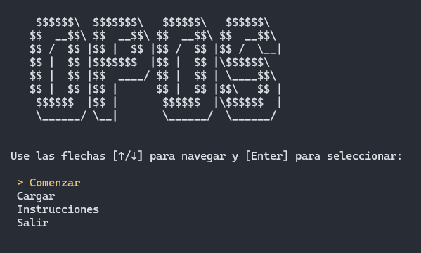
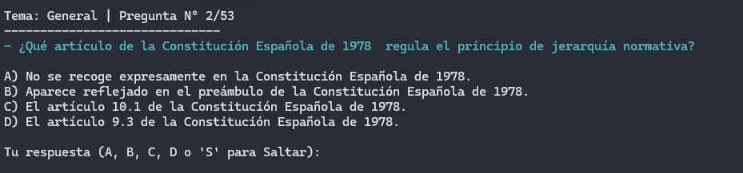

<div align="center">
<pre>
  $$$$$$\
 $$  __$$\
 $$ /  $$ | $$$$$$\   $$$$$$\   $$$$$$$\
 $$ |  $$ |$$  __$$\ $$  __$$\ $$  __$$\
 $$ |  $$ |$$ /  $$ |$$ /  $$ |\$$$$$$\
 $$ |  $$ |$$ |  $$ |$$ |  $$ | \____$$\
  $$$$$$  |$$$$$$$  |\$$$$$$  |$$$$$$$  |
  \______/ $$  ____/  \______/  \_______/
           $$ |
           $$ |
           \__|
</pre>
</div>

<h3 align="center">Console-based exam preparation tool for Spanish civil service exams</h3>

<p align="center">
  <a href="README.es.md">Versión en español</a>
</p>

<p align="center">
  <a href="#-features">Features</a> •
  <a href="#-installation">Installation</a> •
  <a href="#-usage">Usage</a> •
  <a href="#-file-format">File Format</a> •
  <a href="#-controls">Controls</a> •
  <a href="#-compatibility">Compatibility</a>
</p>

---

## 📋 Features

**Opos** is a lightweight, cross-platform console application designed to streamline your civil service exam preparation. Import questions from a simple text file, take practice tests with real-world scoring penalties, and track your progress over time — all from the terminal.

### Study Modes
- **Standard Exam** — Full topic selection or individual topics
- **Failed Questions Review** — Automatically generates a test from every question you've previously answered incorrectly
- **Topic Filtering** — Select specific topics from multi-topic question files
- **Question & Option Shuffling** — Randomize question order and/or answer option positions to avoid memorization

### Scoring & Penalties
Choose from four scoring systems commonly used in official exams:

| Mode | Penalty |
|------|---------|
| Standard | No penalty for wrong answers |
| Opposition | 3 wrong answers deduct 1 correct |
| Hard | 2 wrong answers deduct 1 correct |
| Sudden Death | 1 wrong answer deducts 1 correct |

### Statistics & Progress Tracking
All results are stored in a local SQLite database:
- **General Summary** — Total exams taken, average score, best & worst results
- **Exam History** — Last 20 exams with date, topic, score, and completion time
- **Weakest Topics** — Visual failure rate bars per topic
- **Most Missed Questions** — Top 10 most frequently incorrect answers with correct letter

### Performance Metrics
- Real-time timer per question and overall exam
- Average response time displayed at results screen

---

## 🚀 Installation

### Requirements
- [.NET 9.0 SDK](https://dotnet.microsoft.com/download/dotnet/9.0) or later

### Build from Source
```bash
git clone https://github.com/JorGkm/Opos.git
cd Opos
dotnet build
dotnet run
```

### Run Directly
```bash
dotnet run --project Opos.csproj
```

---

## 📝 Usage

### 1. Create Your Questions File
Create a `.txt` file (e.g., `questions.txt`) on your desktop with the following format:

```
TOPIC 1 - The Spanish Constitution
1. What is the capital of Spain?
a) Barcelona
b) Madrid
c) Seville
d) Valencia

2. How many autonomous communities does Spain have?
a) 15
b) 17
c) 19
d) 20

### RESPUESTAS ###
PREG 1 - RESP: B
PREG 2 - RESP: B
```

### 2. Load Questions
From the main menu, select **"Load"** and provide the path to your `.txt` file. You can also drag and drop the file directly into the console.

### 3. Configure & Start
When you select **"Start"**, you'll be prompted to:
1. **Choose exam mode** — Standard exam or failed questions review
2. **Select topics** — All topics or a specific one (if multiple exist)
3. **Choose shuffling** — Randomize questions, options, both, or neither
4. **Set penalty mode** — Pick your scoring system

### 4. Answer & Review
Navigate through questions using the keyboard controls. After each question, you'll see instant feedback. At the end, a detailed results screen is shown and automatically saved.

---

## 📄 File Format

### Required Structure
| Element | Format |
|----------|---------|
| **Topic** | `TEMA <number>` |
| **Topic name** (optional) | `TOPIC 1 - The Spanish Constitution`<br>`TOPIC 2: Fundamental Rights`<br>`TOPIC 3 — State Organization` |
| **Question** | `<number>. <text>` or `<number>- <text>` |
| **Options** | `a) <text>`<br>`b) <text>`<br>`c) <text>`<br>`d) <text>` |
| **Answers separator** | `### RESPUESTAS ###` |
| **Answers table** | `PREG 1 - RESP: B` or similar tabular format |

---

## 🎮 Controls

During the test, both methods work simultaneously:

**Visual Navigation:**
| Key | Action |
|-----|--------|
| `↑` / `↓` | Navigate between options |
| `Enter` | Confirm selected option |
| `Space` | Skip the question |

**Direct Input:**
| Key | Action |
|-----|--------|
| `A` / `B` / `C` / `D` | Answer directly |
| `S` | Skip the question |

---

## 📊 Statistics

Select **"Statistics"** from the main menu to view:
- Overall performance metrics
- Color-coded exam history (green = pass, red = fail)
- Weakest topics with failure rate visualization
- Most frequently missed questions

All data is stored in a local `opos.db` SQLite database in the application directory.

---

## 🖥️ Compatibility

| Platform | Support |
|----------|---------|
| **Windows** | ✅ Full support |
| **Linux** | ✅ Full support |
| **macOS** | ✅ Full support |

---

## 📸 Screenshots

<p align="center">
    <a href="Screenshots/OposMenu.PNG">
        
    </a>
</p>

<p align="center">
    <a href="Screenshots/OposPregunta.PNG">
        
    </a>
</p>

---

## 📄 License

This project is licensed under the terms of the [LICENSE](LICENSE) file.
