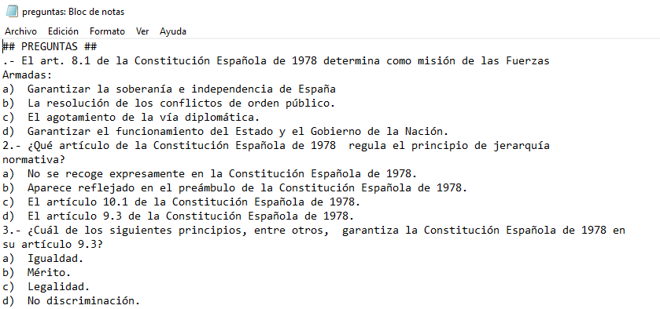
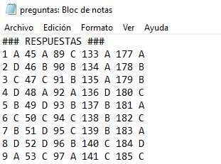
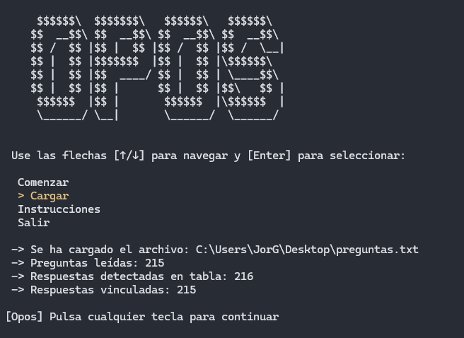
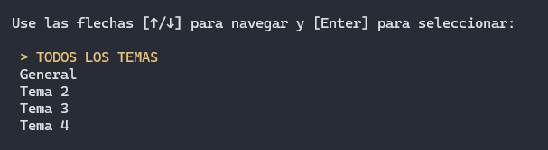
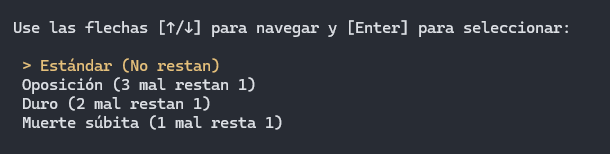

<pre>
 $$$$$$\                                
$$  __$$\                               
$$ /  $$ | $$$$$$\   $$$$$$\   $$$$$$$\ 
$$ |  $$ |$$  __$$\ $$  __$$\ $$  _____|
$$ |  $$ |$$ /  $$ |$$ /  $$ |\$$$$$$\  
$$ |  $$ |$$ |  $$ |$$ |  $$ | \____$$\ 
 $$$$$$  |$$$$$$$  |\$$$$$$  |$$$$$$$  |
 \______/ $$  ____/  \______/ \_______/ 
          $$ |                          
          $$ |                          
          \__|                          
</pre>

## Descripción 📋

Un asistente para sacarte tus tan preciadas oposiciones, si estás aburrido de la forma tradicional en la que se realizan los tipo test, de responder y luego ir una por una mirando cuales tienes bien o mal para finalmente hacer la operación adecuada y tener tus resultados. No te preocupes, Opos ya hace todo eso por ti y más...
Un programa de consola muy sencillo pero no por ello menos práctico. Opos te permite darle un archivo de texto es decir un archivo.txt, el cual analizará mediante una estructura que se debe cumplir para que Opos cumpla bien su funcionamiento, no te preocupes es muy sencillo y lo explicaré más abajo. Se ocupa de recopilar todas las preguntas, opciones y tabla de respuestas que le metas en el archivo de texto, el mismo se encargará de organizarlas y vincular cada respuesta a su pregunta. 
Te ofreze varias formas de estudiar, ya sea por temas separados o en todos los temas/preguntas que contenga el archivo de texto después de ello antes de realizar el test te preguntará que tipo de penalización deseas practicar, es decir podrás elegir distintas opciones, desde la más tranquila como que las respuestas erróneas no quiten, hasta la más desafiante como la eliminación de acierto por pregunta respondida de manera incorrecta.
Finalmente cuando termines tu exámen serás informado con datos sobre tu eficacia en el test realizado, desde los aciertos y fallos como del tiempo por respuesta medio.

    

    

## Instrucciones 📝
Una vez hayas descargado Opos, simplemente debes de cread en tu escritorio un archivo de texto, a este le llamaremos preguntas.txt.
Dentro de este archivo copiaremos y pegaremos las preguntas y respuestas en el siguiente formato:

    

    

Ejecuta Opos y antes de iniciar deberás cargarle el archivo mediante la opción "Cargar" en el menu de inicio:

    

Después te pedirá, en caso de que encuentre temarios distintos, que eligas si quieres un tema en particular o todas las preguntas del archivo de texto.
A continuación muestro un ejemplo:

    

Luego tocará elegir que tipo de penalización deseas tener en el tipo test que vas a realizar, teniendo disponible las opciones más comunes en los exámenes:

    

## Compatibilidad

* **Windows** 💻
* **Linux** 🐧
* **MacOS** 🍎
